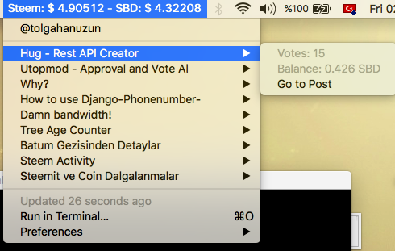

## Steembar - MacOS Manu App
Steem and Steem show their dollar rates.Steemit will notify you about the last 10 posts in your blog.

## How to Install Steembar?

- First bitbar install.
```bash
brew cask install bitbar
```
- Open bitbar end Plugin folder create.

```bash
pip install requests

git clone https://github.com/tolgahanuzun/steembar
cp steembar/steembar.py Plugin_folder/steembar.py
chmod 744 steembar.py
```

Last

```bash
export steemitname=steemitusername 
```

And the installation is finished !!

## Demo Show




